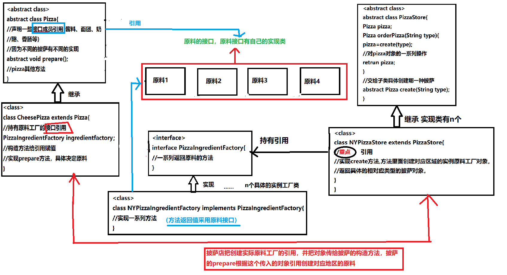
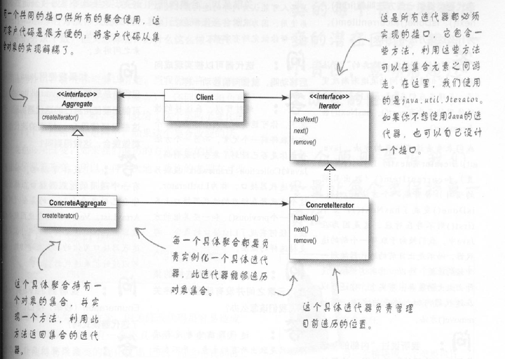

# design_pattern

>个人学习记录的设计模式，代码采用Java实现

# 目录
- [1、策略模式](#策略模式)
- [2、观察者模式](#观察者模式)
- [3、装饰者模式](#装饰者模式)
- [4、工厂方法模式](#工厂方法模式)
- [5、抽象工厂模式](#抽象工厂模式)
- [6、单例模式](#单例模式)
- [7、命令模式](#命令模式)
- [8、适配器模式](#适配器模式)
- [9、外观模式](#外观模式)
- [10、模板方法模式](#模板方法模式)
- [11、迭代器模式](#迭代器模式)
- [12、组合模式](#组合模式)
- [13、组合迭代器模式](#组合迭代器模式)
###### 更新中，不要催......

## 设计原则

>分装变化

>针对接口编程而不是针对实现编程

>多用组合，少用继承

>为了交互对象之间的松耦合设计而努力

>类应该对扩展开放，对修改关闭。

>依赖倒置原则：要依赖抽象，不要依赖具体类

>最少知识原则：只和你的密友交谈

>好莱坞原则:别调用我们，我们会调用你

>一个类应该只有一个引起变化的原因
#### 策略模式

>
    策略模式：定义了算法族，分别封装起来，让它们之间可以互相替换，此模式让算法的
变化独立于使用算法的客户。

<pre>
   （多用组合，少用继承，多多持有引用，引用可以做很多事情，后面很多模式都是引用使
用的很多）多用组合，少用继承。将类中经常变化的部分提取出来，比如行为，抽象成接口，
由具体的类实现这种接口，从而在初始类里面使用接口引用，动态决定具体实现。（提取要变
化的部分比较难）面向接口编程，而不是实现编程。接口的不同实现方式可以看作算法，具体
使用时可以彼此替换，这就是策略。
</pre>


#### 观察者模式 


>观察者模式：定义了对象之间的一对多依赖，这样一来，当一个对象改变状态时，它的所有
依赖者都会收到通知并自动更新。


<pre>
    推，拉两种方式，使用接口好处更大一点，java内置是采用类而不是接口，被观察者不关
心谁要来观察，注册即可。
</pre>

<pre>
    注意：因为主题和观察者都是接口，而具体的实现交由具体的类，在主题接口中存在对Obs
erver的引用，所以，一个具体的主题也对应许多具体的观察者，具体的主题类里面使用Array
List进行观察者的添加或移除，至于update()方法，在notifyObserver()方法遍历循环
ArrayList对象进行update更新。注意update()方法由具体的实现者提供，update()方法
可能时不同的，java内置的Observable类(相当于这里的Subject)有默认的register，
remove方法，继承者不必重写，使用即可。一个主题可以有很多观察者(一对多)。
</pre>

#### 装饰者模式  

<pre>
    装饰者模式：动态地将责任附加到对象上，若要扩展功能，装饰者提供了比继承更有弹性地
替代方案。
</pre>


<pre>
    三层结构，第一层超类，第二层被装饰者类和装饰者抽象组件类，第三层具体的装饰者类。
继承超类是为了引用类型匹配，方法是共有的，需要重写。
</pre>

<pre>
    三层架构，第一层超类，拥有一个描述具体自身字段的具体方法和一个抽象方法，具体子类
对字段重新赋值，抽象子类将该方法定义为抽象方法，子类必须重写，子类持有超类引用，可以
调用该方法（超类具体方法），也可以调用其他同层次子类的该方法，看引用属于哪一个层次。
</pre>

#### 工厂方法模式


<pre>
    工厂方法模式：定义了一个创建接口对象的接口，但由子类决定要实例化的类是哪一个。工
厂方法让类把实例化推迟到子类。
</pre>

#### 抽象工厂模式


<pre>抽象工厂模式：提供一个接口，用于创建相关或依赖对象的家族，而不需要明确指定具体类。</pre>




#### 单例模式

<pre>确保一个类只有一个实例，并提供一个全局访问点。</pre>

[文本记录](src/com/lv/code/day0818/单例模式/description.txt)

#### 命令模式

<pre>
    命令模式:将"请求"封装成对象，以便使用不同地请求，队列或者日志来参数化其他对象。
命令模式也支持可撤销的操作。
</pre>

[文本记录](src/com/lv/code/day0818/命令模式/description.txt)

#### 适配器模式

[文本记录](src/com/lv/code/day0821/适配器模式/descrition.txt)

<pre>
    适配器模式:将一个类的接口，转换成客户期望的另一个接口，适配器让原本接口不兼容的
类可以合作无间。
</pre>

#### 外观模式

<pre>
    外观模式：提供了一个统一的接口，用来访问子系统中的一群接口。外观定义了一个高层接
口，让子系统更容易使用。
</pre>

<pre>
    将很多子系统的复杂底层操作封装成方法，对外暴露出要实现目的的简单接口，客户只需要
调用这些简单接口即可实现自己的目的，而不再需要关注复杂的底层操作，隔离复杂子系统和客
户。客户如果觉得有必要，依然可以使用复杂的子系统操作。
</pre>

#### 模板方法模式

<pre>
    在一个方法中定义一个算法的骨架，而将一些步骤延迟到子类中，模板方法使得子类可以在
不改变算法结构的情况下，重新定义算法中的某些步骤。
    钩子不是必须的，但是通过钩子，可以让子类影响父类中算法的执行步骤，钩子应该提供默
认的实现
</pre>

#### 迭代器模式

<pre>
    迭代器模式提供一种方法顺序访问一个聚合对象中的各个元素，而又不暴露其内部的表示
</pre>



#### 组合模式

<pre>
    允许你将对象组合成树形结构来表现“整体/部分”层次结构。组合能让客户以一致的方式
处理个别对象以及对象组合。
</pre>

### 组合迭代器模式


>重点：组合迭代器模式下面的代码是重点，可以按照上面的图进行在大脑里模拟遍历过程（深度优先遍历）


```java
    public class CompositeIterator implements Iterator {

    Stack stack = new Stack();

    /**
     * 将我们要遍历的顶层组合的迭代器传入，我们把它抛进一个堆栈结构中。
     *
     * @param iterator
     */
    public CompositeIterator(Iterator iterator) {
        stack.push(iterator);
    }

    /**
     * 当用户想要取得下一个元素时，我们先调用hasNext()来确定是否还有下一个。
     *
     * @return
     */
    @Override
    public Object next() {
        if (hasNext()) {
            //如果还有下一个元素，我们就从堆栈中取出目前的迭代器，然后取得它的下一个元素
            Iterator iterator = (Iterator) stack.peek();//查看堆栈顶部元素而不删除
            MenuComponent component = (MenuComponent) iterator.next();
            if (component instanceof Menu) {
                //如果元素是一个菜单，我们有了另一个需要被包含进遍历中的组合，所以我们
                //将它丢进堆栈中。
                stack.push(component.createIterator());
            }
            //不管是不是菜单，都要返回该组件
            return component;
        } else {
            return null;
        }
    }

    @Override
    public boolean hasNext() {
        //想要知道是否还有下一个元素，我们检查堆栈是否被清空，
        //如果已经空了，就表示没有下一个元素了
        if (stack.empty()) {
            return false;
        } else {
            //否则，我们就从堆栈的顶层中取出迭代器，看看是否还有下一个元素，
            //如果它没有元素，我们就将它推出堆栈，然后递归的调用hasNext();
            Iterator iterator = (Iterator) stack.peek();
            if (!iterator.hasNext()) {
                stack.pop();
                //这里是当前迭代器没有元素可以遍历时，递归调用hasNext()保证
                //树形结构中所有元素都可以被遍历到
                return hasNext();
            } else {
                //否则表示还有下一个元素，返回true，
                return true;
            }
        }
    }

    /**
     * 不支持删除，只有遍历
     */
    @Override
    public void remove() {
        throw new UnsupportedOperationException();
    }
}
```
### 状态模式
>允许对象在内部状态改变时改变它的行为，对象看起来好像修改了它的类

<pre>
    理解：对象具有某些状态(这些状态会根据某个属性的变化而变化)，不同的状态会导致
动作的实现变得不同。
    将对象的状态抽象成一个接口，这个接口拥有一系列方法(这些方法可能会导致改变对象
状态的这个属性的改变),让对象的状态实现此接口，不同状态的相同方法结果和影响不同，
接口的实现类会持有对象的引用，借助set方法来进行对象状态的改变，对象内部持有接口引用
（所有状态实例）以及对象状态变量，通过构造方法初始化具体的实例，外部调用对象的方法，
（对象内部是通过当前状态变量调用的方法，因为状态不同，结果不同嘛）改变对象的某个属性，
对象的状态随之改变。
请看图：
</pre>


>状态模式类图


